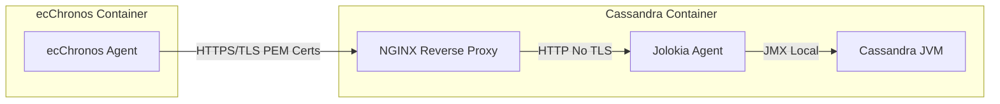

# Architecture

## Summary

- [Overview](#overview)
- [Concepts](#concepts)
  - [Connection](#connection)
  - [Nodes Sync](#nodes-sync)
  - [Repair History](#repair-history)
  - [Leases](#leases)
  - [Scheduling flow](#scheduling-flow)
  - [Scheduled jobs](#scheduled-jobs)
  - [Run policies](#run-policies)
  - [Repair scheduling](#repair-scheduling)
    - [Vnode repairs](#vnode-repairs)
- [JMX Connection Management](#jmx-connection-management)
  - [PEM Certificate Support](#pem-certificate-support)
  - [Reverse DNS Resolution](#reverse-dns-resolution)
- [Sub-range repairs](#sub-range-repairs)
  - [Example](#example)
    - [Repair history](#repair-history)
- [Incremental repairs](#incremental-repairs)
- [References](#references)

## Overview

ecChronos is built to be continuously repairing data in the background. Each ecChronos instance keeps track of the repairs of a group of specified Cassandra nodes, based on the agent type.

<div align="center">

```mermaid
  graph TB
      a[datacenter1]---A((Cassandra Node));
      a[datacenter1]---B((Cassandra Node));
      b[datacenter2]---C((Cassandra Node));
      b[datacenter2]---D((Cassandra Node));
      A((Cassandra Node))---d[ecChronos Agent];
      B((Cassandra Node))---d[ecChronos Agent];
      C((Cassandra Node))---d[ecChronos Agent];
      D((Cassandra Node))---d[ecChronos Agent];
  ```
  <figcaption>Figure 1: ecChronos and Cassandra Nodes.</figcaption>
</div>

## Concepts

### Connection

Once ecChronos establishes its initial connection with the `contactPoints`, it must register its control over the nodes based on the `type` property, whether JMX or CQL, to make it clear that a single instance will be responsible for managing multiple nodes. Then it would be possible to keep track of what was the last time that the ecChronos instances was able to connect with a node, also for others ecChronos instances keep track about each other's health.

If type is `datacenterAware`, ecChronos will register its control over all the nodes in the specified datacenter; The `rackAware` declares ecChronos is responsible just for a sub-set of racks in the declared list; The `hostAware` functionality declares ecChronos is responsible just for the specified hosts list.
Configuration is available on ecc.yml in the below format.

```yaml
connection:
  cql:
    agent:
      instanceName: Each instance must have unique instance name. This will be used as ecchronos_id (partition key in nodes_sync table)
      type: datacenterAware
      contactPoints:
      - host: 127.0.0.1
        port: 9042
      - host: 127.0.0.2
        port: 9042
      datacenterAware:
        datacenters:
        - name: datacenter1
        - name: datacenter2
      rackAware:
        racks:
        - datacenterName: datacenter1
          rackName: rack1
        - datacenterName: datacenter1
          rackName: rack2
      hostAware:
        hosts:
          - host: 127.0.0.1
            port: 9042
          - host: 127.0.0.2
            port: 9042
          - host: 127.0.0.3
            port: 9042
          - host: 127.0.0.4
            port: 9042
    provider: com.ericsson.bss.cassandra.ecchronos.application.AgentNativeConnectionProvider
```

### Nodes Sync

To keep track about nodes and instances, the Agent implementation uses the table nodes_sync, that declare nodes by specific ecChronos instances, each instance must have unique instance name, that must be defined in connection.cql.agent.instanceName in ecc.yml. This will be used as ecchronos_id (partition key in nodes_sync table), to use the agent, is mandatory to create the table below:

```cql
CREATE TABLE ecchronos.nodes_sync
(
    ecchronos_id TEXT,
    datacenter_name TEXT,
    node_id UUID,
    node_endpoint TEXT,
    node_status TEXT,
    last_connection TIMESTAMP,
    next_connection TIMESTAMP,
    PRIMARY KEY
    (
        ecchronos_id,
        datacenter_name,
        node_id
    )
) WITH CLUSTERING ORDER BY(
    datacenter_name DESC,
    node_id DESC
);
```
### Repair History

A RepairHistory table to store relevant repair operation data. Data can be retrieved for auditing or debugging purposes.

```cql
CREATE TABLE ecchronos.repair_history(
    table_id uuid,
    node_id uuid,
    repair_id timeuuid,
    job_id uuid,
    coordinator_id uuid,
    range_begin text,
    range_end text,
    participants set<uuid>,
    status text,
    started_at timestamp,
    finished_at timestamp,
    PRIMARY KEY((table_id,node_id), repair_id))
    WITH compaction = {'class': 'TimeWindowCompactionStrategy'}
    AND default_time_to_live = 2592000
    AND CLUSTERING ORDER BY (repair_id DESC); 
```

### Leases

A lock table in Cassandra makes sure only a subset of repairs run at any one time. Repairs can be configured to run only during certain time periods or not at all. Settings for backpressure are provided to make sure repair is spread out over the interval time while alarms are provided to signal when a job has not run for longer than expected.

<div align="center">

  ```mermaid
  flowchart TB
    A[Create Lease] -->|Failed| b[Sleep]
    b[Sleep] --> A[Create Lease]
    A[Create Lease] -->|Succeeded| c[Get the Lock]
    c[Get the Lock] --> D[Periodically Renew Lease]
    D[Periodically Renew Lease] -->|Failed| A[Create Lease]
    D[Periodically Renew Lease] -->|Succeeded|D[Periodically Renew Lease]
  ```

  <figcaption>Figure 2: Lease Typically Election.</figcaption>
</div>

In order to perform distributed scheduling ecChronos utilize two things `deterministic priorities` and `distributed leases`.
Deterministic priorities means that all nodes use the same algorithm to decide how important the local work is.
By having the priorities deterministic it is possible to compare the priority between nodes and get a fair scheduling.
Each time a node wants to perform some work a lease needs to be acquired for the node and should typically go to the node with the highest priority. It bestows upon the node to conduct repair during a specific time frame. Within this duration, the node assesses the data, ensuring that all replicas are updated and consistent. Additionally, it helps prevent multiple nodes from concurrently initiating repairs on the same data, thereby mitigating potential consistency issues and cluster overload.
Once the repair is completed by the node, the "lease" is released, enabling other nodes to request and carry out their own repairs as needed. It helps in efficiently distributing the repair load within the cluster [\[1\]](#references).

The default implementation of leases in ecChronos is based on CAS (Compare-And-Set) with Apache Cassandra as backend.
When the local node tries to obtain a lease it first announces its own priority and check what other nodes have announced.
If the local node has the highest priority it will try to obtain the lease.
The announcement is done to avoid node starvation and to try to promote the highest prioritized work in the cluster.

The leases are created with a TTL of 10 minutes to avoid locking in case of failure.
As some jobs might take more than 10 minutes to run the lease is continuously updated every minute until the job finishes.

<div align="center">

  ```mermaid
  flowchart LR
      A(((Local Node))) --> a[DeclarePriority]
      B(((Other Node))) --> b[DeclarePriority]
      a[DeclarePriority] --> CheckOtherNodePriority
      b[DeclarePriority] --> CheckOtherNodePriority
      CheckOtherNodePriority --> ObtainTheLease
  ```

  <figcaption>Figure 3: Compare-And-Set.</figcaption>
</div>

### Scheduling flow

The scheduling in ecChronos is handled by the `schedule manager`.
The schedule manager is responsible to keep track of the local work queue, check with run policies if a job should run and also to acquire the leases for the jobs before running them.

### Scheduled jobs

The work a node needs to perform is split into different jobs.
The most common example of a job is to keep a single table repaired from the local nodes point of view.
The priority of a job is calculated based on the last time the table was repaired.
Repairs performed outside of the local ecChronos instance would be included towards the progress.

When the job is executed the work is split into one or more tasks.
In the case of repairs one task could correspond to the repair of one virtual node.
When all virtual nodes are repaired the job is considered to be finished and will be added back to the work queue.

As repair is a resource intensive operation the leases are used to make sure that a node is only part of one repair at a time.
It is configurable if the leases should be on a _data center level_ or on a _node level_.

### Run policies

Run policies are used to prevent jobs from running.
Before a job is started the run policies are consulted to see if it is appropriate for the job to run at this time.

The default implementation is time based and reads configuration from a table in Apache Cassandra.
For more information about time based run policy refer to [Time based run policy](TIME_BASED_RUN_POLICY.md)

### Repair scheduling

The repair scheduling begins by providing a [RepairConfiguration](../core/src/main/java/com/ericsson/bss/cassandra/ecchronos/core/repair/RepairConfiguration.java) to the [RepairScheduler](../core/src/main/java/com/ericsson/bss/cassandra/ecchronos/core/repair/RepairSchedulerImpl.java).
The repair scheduler then creates a [TableRepairJob](../core/src/main/java/com/ericsson/bss/cassandra/ecchronos/core/repair/TableRepairJob.java)
or [IncrementalRepairJob](../core/src/main/java/com/ericsson/bss/cassandra/ecchronos/core/repair/IncrementalRepairJob.java)
and schedules it using the [ScheduleManager](../core/src/main/java/com/ericsson/bss/cassandra/ecchronos/core/scheduling/ScheduleManagerImpl.java) [\[2\]](#references).

### Topology Change Management

To handle dynamic topology changes in Cassandra clusters, ecChronos implements a multi-layered approach for detecting and responding to node additions, removals, and status changes:

#### Schema Change Detection

The most effective way to manage schema changes is through the `DefaultRepairConfigurationProvider`, which extends `NodeStateListenerBase`. This component is registered with the CQL Session and receives topology change events:

- **onAdd**: Triggered when new nodes join the cluster
- **onUp**: Triggered when existing nodes come online
- **onRemove**: Triggered when nodes are removed from the cluster
- **onDown**: Triggered when nodes go offline

These three layers provide comprehensive coverage for topology changes:

1. **Primary Detection**: Direct event notifications from the Cassandra driver
2. **Secondary Detection**: Periodic reload mechanism that rebuilds the topology map from scratch
3. **Tertiary Detection**: Status change events (onUp/onDown) that catch nodes transitioning between states

#### Reload Mechanism

Due to a specific timing window where a node might still be initializing and the driver might not send an `onAdd` notification, an additional reload mechanism is implemented:

- **ReloadSchedulerService**: A scheduled service that periodically triggers a complete topology reload
- **Configurable Interval**: The reload frequency can be configured via `connection.cql.reloadSchedule`
- **Full Rebuild**: During reload, the entire node topology map is reconstructed from the current cluster state

This multi-layered approach ensures that topology changes are detected and handled reliably, even in edge cases where immediate event notifications might be missed.

<div align="center">

  ```mermaid
  stateDiagram
      direction LR
      state RepairScheduler {
        direction LR
        RepairConfiguration1
        RepairConfiguration2
        RepairConfiguration3
      }
      state SchedulerManager {
        [...]
      }
      state ShouldJobRunCondition <<choice>>
      RepairScheduler --> CreateRepairJobs
      CreateRepairJobs --> SchedulerManager
      SchedulerManager --> RefreshPriorities
      RefreshPriorities --> PickJobWithHighestPriority
      PickJobWithHighestPriority --> ShouldJobRun
      ShouldJobRun --> ShouldJobRunCondition
      ShouldJobRunCondition --> PickJobWithHighestPriority: No
      ShouldJobRunCondition --> CreateJobTasks: Yes
      CreateJobTasks --> ExecuteTasks
      ExecuteTasks --> SchedulerManager
  ```

  <figcaption>Figure 4: Scheduling flow.</figcaption>

</div>

#### Vnode repairs

Each TableRepairJob keeps a representation of the repair history in the [RepairState](../core/src/main/java/com/ericsson/bss/cassandra/ecchronos/core/repair/state/RepairStateImpl.java).
This information is used to determine when the table is eligible for the next repair and when to send alarms if necessary.

When a table is able to run repair the RepairState calculates the next tokens to repair and collects it in an ordered list of [ReplicaRepairGroups](../core/src/main/java/com/ericsson/bss/cassandra/ecchronos/core/repair/state/ReplicaRepairGroup.java).
The calculation is performed by the [VnodeRepairGroupFactory](../core/src/main/java/com/ericsson/bss/cassandra/ecchronos/core/repair/state/VnodeRepairGroupFactory.java) by default.
The TableRepairJob then generates [RepairGroups](../core/src/main/java/com/ericsson/bss/cassandra/ecchronos/core/repair/RepairGroup.java) which are snapshots from how the state was when it was calculated.
When the RepairGroup is executed it will generate one [VnodeRepairTask](../core/src/main/java/com/ericsson/bss/cassandra/ecchronos/core/repair/VnodeRepairTask.java) per token range to repair.
The VnodeRepairTask is the class that will perform the repair.

## JMX Connection Management

ecChronos establishes JMX connections to Cassandra nodes for repair operations and monitoring. The connection management includes support for TLS with PEM certificates and reverse DNS resolution for containerized environments.

### PEM Certificate Support

PEM certificate support is available **only when using Jolokia** as the JMX transport mechanism. This feature enables secure TLS communication between ecChronos and Cassandra nodes in containerized environments.

#### Architecture Overview

The typical deployment scenario involves a reverse proxy setup where:

<div align="center">



</div>

<figcaption>Figure 5: PEM Certificate Architecture with Jolokia and Reverse Proxy.</figcaption>

#### Configuration Requirements

1. **Jolokia Agent**: Must be running as a Java agent within the Cassandra JVM
2. **Reverse Proxy**: NGINX (or similar) configured with TLS termination
3. **PEM Certificates**: Valid certificates with proper Subject Alternative Names (SANs)
4. **Reverse DNS**: Recommended to resolve hostnames matching certificate SANs

#### Security Benefits

- **TLS Encryption**: Secure communication between ecChronos and the reverse proxy
- **Certificate Validation**: Proper hostname verification against certificate SANs
- **Network Isolation**: JMX communication remains local within the Cassandra container
- **No JMX TLS Overhead**: Cassandra JMX doesn't require TLS configuration

#### Limitations

- **Jolokia Dependency**: PEM certificates are not supported with direct JMX connections
- **Reverse Proxy Required**: Additional component needed for TLS termination
- **Certificate Management**: Proper certificate lifecycle management required

### Reverse DNS Resolution

Reverse DNS resolution enables ecChronos to resolve IP addresses to hostnames when establishing JMX connections. This feature is particularly useful in containerized environments where certificates are issued with DNS names rather than IP addresses.

#### Configuration

```yaml
connection:
  jmx:
    reverseDNSResolution: false  # Default: disabled
```

#### Java Implementation Details

The reverse DNS resolution leverages Java's `InetAddress` methods with specific behavior patterns:

**getCanonicalHostName():**

- Performs a "best effort" reverse DNS lookup to obtain the Fully Qualified Domain Name (FQDN)
- May return the original IP address if DNS resolution fails or is not configured
- Requires proper network DNS configuration for reliable results
- Subject to security manager restrictions (if present)
- Can introduce network latency due to DNS queries

**getHostName():**

- Returns cached hostname if the `InetAddress` was created with a hostname
- Falls back to reverse DNS lookup if no cached hostname exists
- Generally faster than `getCanonicalHostName()` when hostname is cached
- May still return IP address if no hostname resolution is possible

#### Behavior and Edge Cases

1. **DNS Configuration Dependency**: Requires proper reverse DNS records in the network infrastructure
2. **Fallback Strategy**: If canonical hostname resolution fails, falls back to simple hostname resolution
3. **IP Concatenation Handling**: In some containerized environments (like Kubernetes), reverse DNS may return concatenated formats like `<ip>.<hostname>`. ecChronos automatically detects and cleans these formats
4. **Performance Impact**: DNS lookups introduce latency; disable if not needed
5. **Security Considerations**: Subject to security manager policies that may restrict hostname resolution

#### When to Enable

**Enable reverse DNS resolution when:**

- Using PEM certificates with hostname-based SANs
- Operating in containerized environments with proper DNS setup
- Certificate validation requires hostname matching
- Network infrastructure supports reliable reverse DNS

**Keep disabled when:**

- Using IP-based connections without certificates
- DNS infrastructure is unreliable or not configured
- Performance is critical and hostname resolution is unnecessary
- Operating in environments where DNS lookups may fail or timeout

#### Kubernetes Considerations

In Kubernetes environments, reverse DNS resolution may return various formats:

- Standard FQDN: `pod-name.service.namespace.svc.cluster.local`
- IP-concatenated: `10.244.1.5.pod-name.service.namespace.svc.cluster.local`

ecChronos automatically handles these formats by detecting and removing IP prefixes when present, ensuring clean hostname resolution for certificate validation.

## Sub-range repairs

As of [#96][i96] the repair scheduler in ecChronos has support for sub range repairs within virtual nodes.
This is activated by specifying a target repair size in the [RepairConfiguration](../core/src/main/java/com/ericsson/bss/cassandra/ecchronos/core/repair/RepairConfiguration.java).
For the standalone version the option is called `repair.size.target` in the configuration file.
Each sub-range repair session will aim to handle the target amount of data.

_Note: Without this option specified the repair mechanism will handle full virtual nodes only (including how it interprets the repair history)*  
_Note: The target repair size is assuming a uniform data distribution across partitions on the local node*

### Example

With a local table containing 100 bytes of data and a total of 100 tokens locally in a continuous range (0, 100].
When the repair target is set to 2 bytes the range will be divided into 50 sub ranges, each handling two tokens.
The sub ranges would be:  
(0, 2]  
(2, 4]  
...  
(96, 98]  
(98, 100]

#### Repair history

Sub-ranges are handled in two parts, one part is building an internal state of the repair history and the other is performing the repairs.
While building the internal repair history state all sub-ranges which are fully contained within a local virtual node are collected from the repair history.
This means that for a virtual node (1, 5] it will collect ranges such as (1, 3] and (2, 4].
It will not collect (0, 3] since it is not fully contained in the virtual node even though it is intersecting it.

As the sub-range repair mechanism is using dynamic sizes of the sub-ranges there is a need of handling overlapping sub-ranges.
E.g. there could be entries for both (1, 3] and (2, 4] within one virtual node that has been repaired at different times.
This is handled by splitting the history into (1, 2], (2, 3] and (3, 4] where the middle range gets the latest repair time of the two.
In order to keep the memory footprint small these ranges are later consolidated where adjacent ranges that has been repaired closely together are merged.

In a larger context this also works for repairs covering the full virtual node.
Given a virtual node (0, 30] that was repaired at timestamp X and a repair history entry containing the sub range (15, 20] repaired at Y.
Assuming that X is more than one hour before Y this will produce three sub ranges in the internal representation:

- (0, 15] repaired at X.
- (15, 20] repaired at Y
- (20, 30] repaired at X

## Incremental repairs

**Incremental repairs do not use ecchronos repair history**

Each IncrementalRepairJob uses metrics from Cassandra `maxRepairedAt` and `percentRepaired`.
This information is used to determine when the job is eligible for the next repair and when to send alarms if necessary.
The job jumps over intervals if there's nothing to repair, i.e `percentRepaired` is 100%.

When the job runs, it calculates the replicas that might be involved in the repair using
[ReplicationStateImpl](../core/src/main/java/com/ericsson/bss/cassandra/ecchronos/core/repair/state/ReplicationStateImpl.java).
Afterwards a single [RepairGroups](../core/src/main/java/com/ericsson/bss/cassandra/ecchronos/core/repair/RepairGroup.java) is created.
When the RepairGroup is executed it will generate one [IncrementalRepairTask](../core/src/main/java/com/ericsson/bss/cassandra/ecchronos/core/repair/IncrementalRepairTask.java).
The IncrementalRepairTask is the class that will perform the incremental repair [\[3\]](#references).

[i96]: https://github.com/Ericsson/ecchronos/issues/96

## References

 [1\]: [Consensus on Cassandra](https://www.datastax.com/blog/consensus-cassandra);

 [2\]: [Incremental and Full Repairs](https://cassandra.apache.org/doc/latest/cassandra/operating/repair.html#incremental-and-full-repairs)

 [3\]: [Cassandra Metrics](https://cassandra.apache.org/doc/4.1/cassandra/operating/metrics.html#table-metrics)

 [4\]: [Cassandra Driver Node State Events](https://docs.datastax.com/en/developer/java-driver/4.15/manual/core/metadata/#node-state-events)
